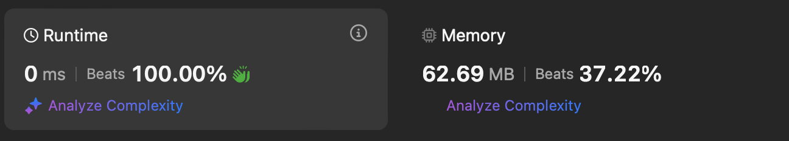

# Leetcode No. Name

 - **Greedy**
 - **Medium**

## Performance


## Complexity
 * Time complexity : $O(n)$
 * Space complexity : $O(1)$

## Algorithm

## Reference Code
```C++
class Solution {
public:
    int maxArea(vector<int>& height) {
        int i = 0, j = height.size() - 1;

        int most_water = 0;
        
        while (j > i) {
            int interval_water = (j - i) * min(height[i], height[j]);
            most_water = max(interval_water, most_water);
            height[i] < height[j] ? i++ : j--;
        }

        return most_water;
    }
};
```