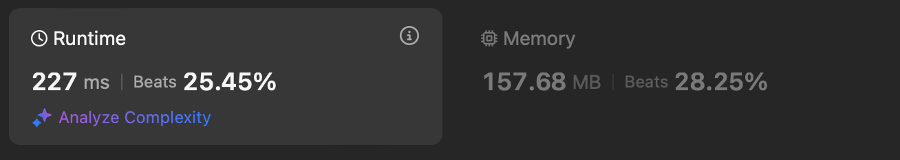

# Leetcode 5 Longest Palindromic Substring

 - **Dynamic Programming**
 - **Medium**

## Performance


## Complexity
 * Time complexity : $O(n^2)$
 * Space complexity : $O(n)$

## Algorithm

## Reference Code
```C++
struct TableContent {
    bool isPalinedrome;
    bool isAllSame;
};

class Solution {
public:
    string longestPalindrome(string s) {
        // initialize table for dynamic programming
        struct TableContent** table;
        table = new struct TableContent*[s.length()];
        for (int i = 0; i < s.length(); i++) {
            table[i] = new struct TableContent[s.length()];
            if (i > 0)
                table[i][i - 1] = {true, true};
        }

        // answer
        int ans_begin = 0;
        int ans_len = 1;

        // loop
        for (int len = 1; len <= s.length(); len++) {
            for (int begin = 0; begin <= s.length() - len; begin++) {
                int end = begin + len - 1;
                if (len == 1) {
                    table[begin][end] = {true, true};
                    ans_begin = begin;
                    ans_len = len;
                } else if (table[begin][end - 1].isPalinedrome) {
                    if (table[begin][end - 1].isAllSame && s[begin] == s[end]) {
                        table[begin][end] = {true, true};
                        ans_begin = begin;
                        ans_len = len;
                    } else
                        table[begin][end] = {false, false};
                } else {
                    if (table[begin + 1][end - 1].isPalinedrome) {
                        if (s[begin] == s[end]) {
                            table[begin][end] = {true, false};

                            if (table[begin + 1][end - 1].isAllSame &&
                                s[begin] == s[begin + 1])
                                table[begin][end].isAllSame = true;

                            ans_begin = begin;
                            ans_len = len;
                        } else
                            table[begin][end] = {false, false};
                    } else
                        table[begin][end] = {false, false};
                }
            }
        }

        // return
        string ans = s.substr(ans_begin, ans_len);
        return ans;
    }
};
```