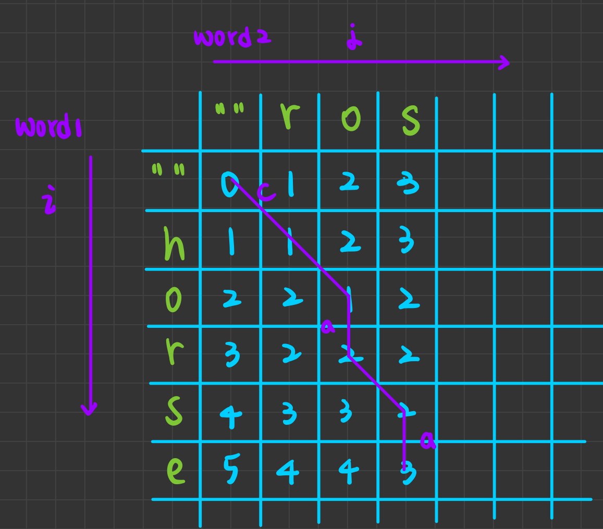

# Leetcode 72 Edit Distance

 - **Dynamic Programming**
 - **Medium**

## Performance


## Compexity
 * Time complexity : $O(n^2)$
 * Space complexity : $O(n)$

## Algorithm
It's a dynamic programming problem. 

Let $table[i][j]$ means the minimum step needed to make the first $i$ alphabets of $word1$ and the first $j$ alphabets of $word2$.

The we can have the following inferences:

1. $table[0][0] = 0$ 

    They're both empty strings.

2. if $word1[i] = word2[j]$ 

    then $table[i][j] = table[i - 1][j - 1]$

3. if $word1[i] != word2[j]$

    then we can get the first $i$ alphabets of $word1$ and the first $j$ alphabets of $word2$ by three possible cases:

    a. $table[i-1][j]$ &rarr; $table[i][j]$ 
        
    word2 insert 1 alphabet
    &harr; word1 remove 1 alphabet

    b. $table[i][j-1]$ &rarr; $table[i][j]$ 
        
    word1 insert 1 alphabet

    c. $table[i-1][j-1]$ &rarr; $table[i][j]$ 
        
    word1 replace 1 alphabet

So we can construct a table like:



## Improvement

 * To reduce Space Complexity, use **rolloing table** in dynamic programming.

## Reference Code

```c++
class Solution {
public:
    int minDistance(string& word1, string& word2) {
        short** arr;
        arr = new short*[2];
        arr[0] = new short[word2.length() + 1];
        arr[1] = new short[word2.length() + 1];

        for (short j = 0; j <= word2.length(); j++) {
            arr[0][j] = j;
        }

        for (short i = 1; i <= word1.length(); i++) {
            for (short j = 0; j <= word2.length(); j++) {
                if (j == 0) {
                    arr[i % 2][0] = i;
                    continue;
                }
                if (word1[i - 1] == word2[j - 1]) {
                    arr[i % 2][j] = arr[(i - 1) % 2][(j - 1)];
                    continue;
                }
                arr[i % 2][j] = min(arr[(i - 1) % 2][(j - 1)], min(arr[(i - 1) % 2][j], arr[i % 2][(j - 1)])) + 1;
            }
        }

        return arr[word1.length() % 2][word2.length()];
    }
};
```

### p.s.
The problem is originally a `Hard level` problem, and became `Medium level` problem.